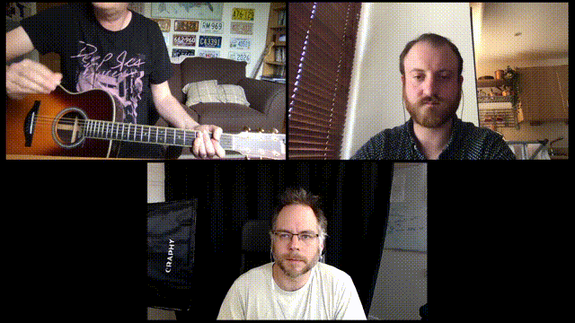

# stitcheroo

[](https://opensource.org/licenses/MIT) [](https://callforcode.org/slack)

Stitch all of your videos into a lovely big video wall.

## Description

This module was created as part of the [Choirless project](https://github.com/choirless), now released as part of [Rend-o-matic](https://github.com/Rend-o-matic).

stitcheroo is a module that takes a list of video filepaths and then combines them together using FFmpeg to output a single video with all the source videos next to each other. The generated video is then returned as a buffer.

## Usage

### Example

```javascript
const sticheroo = require('stitcheroo');
const fs = require('fs');

const videosToCombine = [`${__dirname}/vid_1.mp4`, `${__dirname}/vid_2.mp4`, `${__dirname}/vid_3.mp4`]

// Options can be passed to Stitcheroo to affect the output.
// Below are the default values, but you can  
// change them as you like.
const options = {
    dimensions : {
        width: 1920,
        height: 1080
    },
    margin: 20,
    center: true,
    returnAsFile: false,
    pan: true
};

stitcheroo(videosToCombine, options)
    .then(data => {

        // Data is a buffer with the generated video contained within.
        // Once the buffer is created, no file persists on the system
        // so we'll write it to a file here, but you can do what you
        // like with it.

        fs.writeFileSync('written_output.mp4', data);

    })
    .catch(err => {
        console.log('Err:', err);
    })
;

```

## Stitcheroo Arguments

```javascript
stitcheroo(
    `[VIDEO FILE PATHS ARRAY]`, 
    `[OPTIONS OBJECT]`
);
```

#### VIDEO FILE PATHS

This is an array of file paths pointing to the videos you'd like to combine. The videos passed will be proportionately scaled to fit within a 1920x1080 pixel container (HD video dimensions) and centered both horizontally and vertically.

#### OPTIONS

Defaults:
```json
{
    dimensions : {
        width: 1920,
        height: 1080
    },
    margin: 20,
    center: true,
    returnAsFile: false,
    pan: true,
    reverb: {
        type: 'none',
        mix: 0.1
    }
}
```

##### dimensions

An object with the desired width and height value for the output video. All videos to be rendered will be fit into these dimensions. If you pass a dimensions object, you must have both a width and height value. If either is omitted, the function will reject. If dimensions is omitted, the values will default to a width of 1920 and height and 1080.

##### margin

A pixel value for the space around the videos.

##### center

Center the passed videos horizontally and vertically in the output video

##### returnAsFile

By default, Stitcheroo will return your rendered video as a buffer which you can handle as you wish. If you would rather handle a path to the file, you can pass `true` on this property.

##### pan

By default (`true`), Stitcheroo will pan the audio of each video to the left or right depending on its position in the output video e.g. videos on the left hand side of the output video will have their audio panned to the left.

To leave the input audio alone, pass `false` for this property.

##### reverb

The reverb object describes what type and how much reverberation effect to add to that output audio. By default none is added:

```js
  reverb: {
      type: 'hall', 
      mix: 0.3
  }
```

- `reverb.type` - one of: `none`, `smallroom`, `largeroom`, `hall`, `church`.
- `reverb.mix` - a number between 0 and 1 that determines how much reverb effect is added into the mix. 0 = none, 1 = full.

## Output


